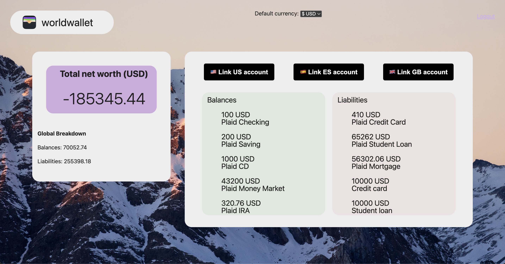

# worldwallet
Financial tracker that connects your global bank accounts and displays your finances in real time.

## Idea
I've had the opportunity to live in 5 countries during my life, and I've opened bank accounts in each of these countries. Keeping track of my finances in one country is already difficult, but keeping track of my global finances has been a true challenge.

For years I looked for solutions to manage my finances, but most apps have these problems: access to financial information from only one country, restricted to one currency, complex UI and being subscription-based.

worldwallet is my attempt to make global financial tracking accessible to everyone. In a simple and elegant app.

This is what sets worldwallet apart:
* ✨ clean and intuitive interface
* 🌎 global access to financial data
* 💸 live currency conversion

## Description


worldwallet is a networth tracker for the global nomad. It connects to your bank accounts in different countries, and shows your combined balances and liabilities.

The dashboard shows all your global balances and liabilities in separate lists. You are also able to see your total networth.

The app uses Plaid (a security-first API service that authenticates financial information) to retrieve and update the financial data displayed on the dashboard.

Supported countries: 🇺🇸 Unites States, 🇪🇸 Spain and the 🇬🇧 United Kingdom.

Note: 
1) to connect to your real bank accounts' balances and liablilites data, you MUST pay for the Plaid API.
2) not all countries offer access to balances and liablities data, check Plaid's website for more information: https://plaid.com/en-gb/global/
3) in the app, only the US bank accounts offer LIABILITY information. But US, Spain, and UK bank accounts offer BALANCES data. 

## Technologies
* [React](https://reactjs.org/)
* [Express](https://expressjs.com/)
* [MongoDB](https://www.mongodb.com/)
* [Mongoose](https://mongoosejs.com/)
* [Plaid](https://plaid.com/en-gb/)

## Getting started

### 1. Install dependencies
1) Requirements
* install mongodb on your computer: https://www.mongodb.com/docs/v7.0/administration/install-community/
* get your PLAID CLIENT ID and PLAID SECRET, follow the instructions on their website: https://www.mongodb.com/docs/v7.0/administration/install-community/

2) Clone the repository
```
git clone https://github.com/diegoss-github/world-wallet.git
```

3) Install dependencies
Client folder:
```
npm install
```

Server folder:
```
npm install
```

4) Configure your environment
```
cp server/.env.example server/.env
# Edit server/.env
# 1. PLAID_ENV sandbox is for test usage. Change to development to access real bank accounts.
# 2. for SESSION_SECRET input a long unique string.
```

5) Run the project
```
# Starts the client
npm run dev

# Starts the server
npm run dev
```